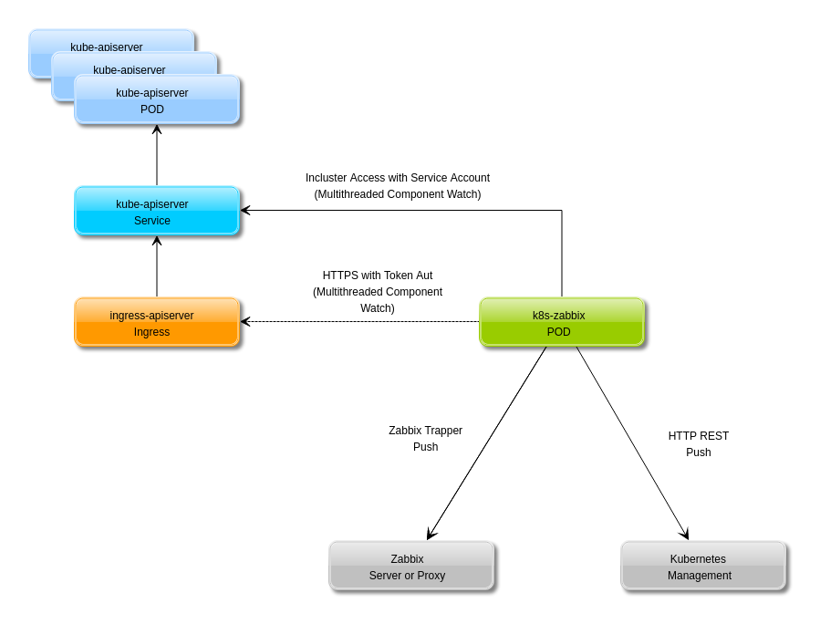

k8s-zabbix
=================

This project provides kubernetes monitoring capabilities for zabbix using the kubernetes watch api mechanism.
Additionally it provides capabilities to submit the same data to a system management solution by REST.

New Kubernetes entities are submitted as [low level discovery](https://www.zabbix.com/documentation/current/manual/discovery/low_level_discovery)
items in the moment of their creation (i.e. a new deployment). Kubernetes events (i.e. a pod restart) are submitted in moment of their occurrence.

This tool aggregates status information of entities in some cases to the managing entity to improve the practical usage with zabbix
(example: aggregation of the pod statuses to the deployment which manages the pods)
Disappearing entities will be deleted by zabbix using the "Keep lost resources period" setting.

Optionally this tool can submit kubernetes entities to a webservice in a unaggregated manner.
This might be a very useful thing if you have left the GitOps paradigm behind and built a fully fledged management system for your infrastructure. 

The solution currently supervises the following types of Kubernetes entities:

* apiserver : Check and discover apiservers
* components : Check and discover health of k8s components (etcd, controller-manager, scheduler etc.)
* nodes: Check and discover active nodes
* pods: Check pods for restarts
* deployments: Check and discover deployments
* daemonsets: Check and discover daemonsets readiness
* replicasets: Check and discover replicasets readiness
* tls: Check tls secrets expiration dates

For details or a overview of the monitored kubernetes attributes, have a look at the [documentation](http://htmlpreview.github.io/?https://github.com/zabbix-tooling/k8s-zabbix/blob/master/documentation/template/custom_service_kubernetes.html)

The current docker image is published at https://hub.docker.com/repository/docker/scoopex666/k8s-zabbix/

Architecture Details
=====================




Behavior of the system:

* k8s-zabbix queries the kubernetes api service for several types of k8s entities (see above)
* discovered data is stored in a internal cache of k8s-zabbix
* new k8s entities are sent to zabbix or optionally to a configurable webservice
* if a k8s entity disappears, zabbix and/or optionally a configurable webservice are notified
* if k8s entities appear/disappear the zabbix discover for low level disovery is updated
* known entities (discovery and data) will be sent to zabbix and/or the webservice in a configurable schedule
* sentry can optionally used as error tracking system


Testing and development
=======================


* Clone Repo and install dependencies
  ```
  git clone git@github.com:zabbix-tooling/k8s-zabbix.git
  virtualenv -p python3 venv
  source venv/bin/activate
  pip3 install -r requirements.txt
  ```
* Create monitoring account
  ```
  kubectl apply -f kubernetes/monitoring-user.yaml
  ```
* Gather API Key
  ```
  kubectl get secrets -n monitoring
  kubectl describe secret -n monitoring <id>
  ```
* Test
  ```
  source venv/bin/activate
  cp config_default.py configd_c1.py
  # edit to appropriate values for your setup
  vim configd_c1
  ./check_kubernetesd configd_c1
  ```
* Test in docker (IS ESSENTIAL FOR PUBLISH)
  ```
  ./build.sh default
  ```
* Create release
  ```
  git tag NEW_TAG
  git push --tags
  ./build.sh default
  ./build.sh publish_image
  ```
Production Deployment
=====================

* Clone Repo and install dependencies
  ```
  git clone git@github.com:zabbix-tooling/k8s-zabbix.git
  ```
* Clone Repo and install dependencies
  ```
  ./build.sh default
  MY_PRIVATE_REGISTRY="docker-registry.foo.bar"
  docker tag k8s-zabbix:latest $MY_PRIVATE_REGISTRY:k8s-zabbix:latest
  docker push $MY_PRIVATE_REGISTRY:k8s-zabbix:latest
  ```
* Get API Key
  ```
  kubectl get secrets -n monitoring
  kubectl describe secret -n monitoring <id>
  ```
* Create monitoring account and api service
  ```
  kubectl apply -f kubernetes/service-apiserver.yaml
  kubectl apply -f kubernetes/monitoring-user.yaml
  ```
* Configure a ingress for that service with valid ssl certificate for high available access to the kubernetes API<BR>
  (otherwise set SSL\_VERIFY to "False")
  ```
  vi kubernetes/ingress-apiserver.yaml
  kubectl apply -f kubernetes/ingress-apiserver.yaml
  ```
* Zabbix Configuration
  * Import the monitoring template [zabbix template](template/custom_service_kubernetes.xml) to zabbix : Configuration →  Templates → Import
  * Create a virtual monitoring host for your kubernetes cluster <BR>
    (i.e. "k8s-prod-001", name should match to the ZABBIX\_HOST in the deployment.yaml of the next step)
  * Assign the template to that host
* Create and apply deployment
  (adapt the configuration values for your environment)
  ```
* Adapt values corresponding to your cluster setup, use ENV Variables defined in config_default.py
  vi kubernetes/deployment.yaml

  kubectl apply -f kubernetes/deployment.yaml
  ```
* Check proper function
  * Review the logs of the pod
    ```
    kubectl logs -n monitoring k8s-zabbix... -f
    ```
  * Review latest data in zabbix
    * "Monitoring" →  "Latest data" →  "Add Hosts": i.e. "k8s-prod-001"
    * Enable Option "Show items without data" →  Button "Apply"

Unix Signals
=======

Unix signals are usefuil for debugging:

 * SIGQUIT: Dumps the stacktraces of all threads and terminates the daemon
 * SIGUSR1: Display a overview of data hold in CheckKubernetesDaemon.data and CheckKubernetesDaemon.discovery_sent
 * SIGUSR2: Display detailed data hold in CheckKubernetesDaemon.data and CheckKubernetesDaemon.discovery_sent

Authors
=======

- Amin Dandache <amin.dandache@vico-research.com>
- Marc Schoechlin <ms-github@256bit.org>

This project is heavily modified fork of [https://github.com/posuch/zabbix-kubernetes-1](https://github.com/posuch/zabbix-kubernetes-1)

Licence
=======

see "[LICENSE](./LICENSE)" file
